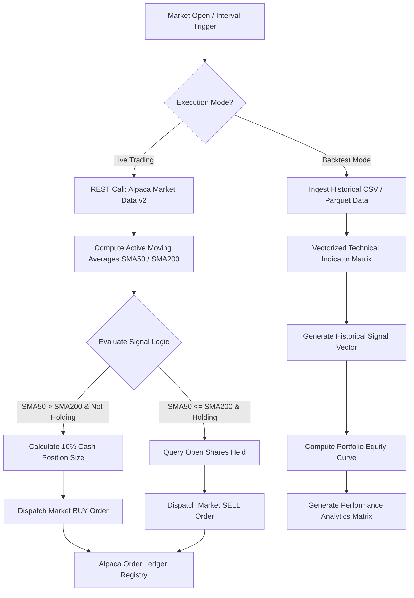

# 📈 Automated Algorithmic Trading Pipeline

[](https://www.python.org)
[](https://alpaca.markets)
[](https://opensource.org/licenses/MIT)

[](https://github.com/Vipeen21)
[](https://github.com/Vipeen21/Quant-finance/stargazers)
[](https://github.com/Vipeen21/Quant-finance/network/members)

---

### **Turn Raw Market Data into Automated Execution Strategies**
Welcome to the core repository for production-ready, quantitative trading systems. This project bridges the gap between historical quantitative analysis and institutional-grade, live-execution engines. Utilizing a robust Dual Moving Average Crossover framework powered by the **Alpaca Trade API**, this architecture minimizes manual overhead, optimizes entry execution via algorithmic discipline, and includes pre-production simulation validation modules.

---

## 📌 Repository Overview

This project delivers a complete algorithmic trading life cycle divided into two specialized execution layers:

1.  **Historical Backtesting Matrix (`algo trading with backtesting.py`)**: A local computation layer designed to ingest historical market metrics, simulate complex trend-following models, account for transactional slippage, and output standard quantitative metrics.
2.  **Live Paper Trading Engine (`algo-trading_using_alpaca_api.py`)**: An asynchronous execution loop integrated directly into the **Alpaca Markets Paper API**. This script features runtime account capital protection, automated position sizing, and persistent asset state monitoring.

---

## 📊 System Design & Structural Workflow

The architectural layout below outlines how market state inputs are queried, computed, validated against risk thresholds, and routed directly to liquidity providers.



---

## ⚙️ Technical Blueprint & Implementation Breakdown

### 1. Vectorized Strategy Execution Core

The fundamental financial mathematics rely on the interaction of short-term and long-term price velocity trends. The system tracks structural shifts via the Simple Moving Average ($SMA$):

$$\text{SMA}_k = \frac{1}{k} \sum_{i=0}^{k-1} P_{t-i}$$

The core engine tracks:

* **Fast Momentum Indicator ($SMA_{50}$)**: Sensitive to short-term cyclical shifts.
* **Slow Momentum Baseline ($SMA_{200}$)**: Institutional anchor establishing long-term secular trends.

A formal **Golden Cross** occurs when the faster moving average crosses above the slower baseline, establishing a bullish structural shift. A **Death Cross** indicates structural breakdown, initiating automated asset liquidations.

### 2. Module Comparison Matrix

| Operational Component | Historical Backtester (`algo trading with backtesting.py`) | Live Execution Engine (`algo-trading_using_alpaca_api.py`) |
| --- | --- | --- |
| **Data Fetch Mechanism** | Local CSV processing / Vectorized arrays | Asynchronous REST Polling (`api.get_bars`) |
| **Compute Complexity** | Batch Vectorized Calculations | Single-step Tail Evaluation (`.iloc[-1]`) |
| **Risk Management** | Global Portfolio Compounding | Strict Account Capital Fractional Sizing (10%) |
| **Order Processing** | Instant Simulated Book Fills | Real-time Market Orders (`time_in_force='gtc'`) |
| **State Registry** | Historical Data Frames | Dynamic Endpoint Checks (`api.get_position`) |

---

## 🚀 Installation & Local Workspace Deployment

### Environment Prerequisites

Ensure your local compute station running Python 3.8+ contains the required analytical wrappers:

```bash
pip install pandas numpy matplotlib alpaca-trade-api

```

### Configuration & Deployment Matrix

1. **Initialize Workspace Identity**: Clone the version-controlled directory locally:
```bash
git clone [https://github.com/Vipeen21/Algo-trading.git](https://github.com/Vipeen21/Algo-trading.git)
cd Algo-trading

```


2. **Setup Market Parameters**: Securely store your environment keys or embed your paper trading credentials directly into the designated variables within `algo-trading_using_alpaca_api.py`:
```python
API_KEY = 'YOUR_ALPACA_PAPER_KEY'
SECRET_KEY = 'YOUR_ALPACA_SECRET_KEY'
BASE_URL = '[https://paper-api.alpaca.markets](https://paper-api.alpaca.markets)'

```


3. **Initialize the Production Daemon**: Boot the continuous trading automation loop:
```bash
python algo-trading_using_alpaca_api.py

```


---

## 🗺️ Vision Framework & Engineering Roadmap

* [ ] **Advanced Risk Parity Matrices**: Migrate from simple static fractional constraints to dynamically optimized Kelly Criterion sizing models.
* [ ] **Order Execution Upgrades**: Transition market execution routines into iceberg or TWAP setups to shield strategies against high-frequency front-running.
* [ ] **Asynchronous WebSockets Framework**: Re-engineer the continuous engine using stream-based event queues rather than fixed polling timers (`time.sleep`).
* [ ] **Alternative Momentum Integration**: Supplement simple trend signals with Exponential Moving Averages ($EMA$) and Relative Strength Index ($RSI$) filters to weed out false breakouts in choppy ranges.

---

## 👨‍💻 Connect & Engage with the Project

If this codebase helped jumpstart your quantitative journey, please consider starring and contributing to the repository!

* **Author:** Vipeen Kumar
* **LinkedIn:** [Profile Link](https://www.google.com/search?q=https://linkedin.com/in/vipeen-kumar-908212b8)
* **Portfolio Website:** [vipeen21.github.io](https://www.google.com/search?q=https://vipeen21.github.io)

---

### **Legal Disclaimer**

> ⚠️ **Disclaimer**: Quantitative trading contains substantial financial risk. The scripts provided here are configured for testing environments and paper trading portfolios. Past simulated performance does not guarantee future live returns. Implement responsibly.
